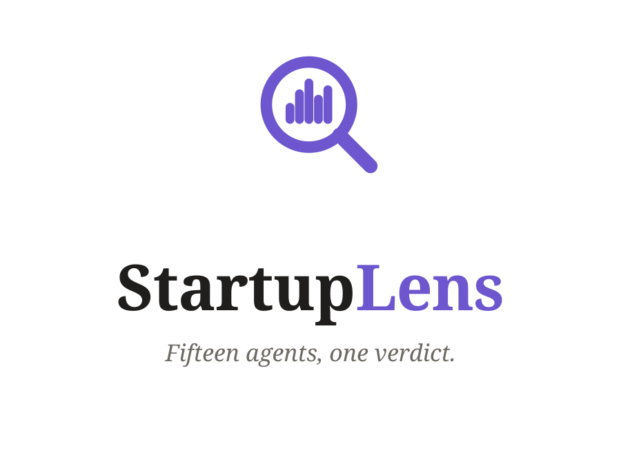
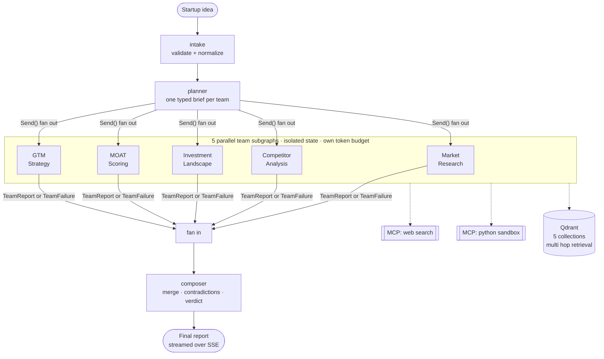
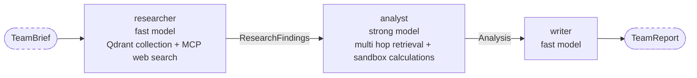

<div align="center">

<picture>
  
</picture>

<br/>

**Give it a startup idea. Fifteen specialized agents in five parallel teams research the market, map the competition and investors, score the moat, and design a go to market plan, live, in minutes.**

[](https://www.python.org/)
[](https://nextjs.org/)
[%20fan%20out-orange>)](https://github.com/langchain-ai/langgraph)
[](https://modelcontextprotocol.io/)
[](LICENSE)

[**Example Reports**](#example-reports) · [**Architecture**](#architecture) · [**Engineering Findings**](#engineering-findings) · [**Quickstart**](#quickstart)

<!-- TODO: record and embed the live board GIF here after deploy -->
<!--  -->

</div>

---

## What it does

Validating a startup idea properly means days of scattered research. StartupLens compresses it into one run. You enter an idea, and five teams work in parallel while you watch on a live board:

| Team                     | Agents                        | Produces                                                         |
| ------------------------ | ----------------------------- | ---------------------------------------------------------------- |
| **Market Research**      | researcher · analyst · writer | Market size, growth, trends, target customer                     |
| **Competitor Analysis**  | researcher · analyst · writer | Direct and indirect competitors, positioning, pricing comparison |
| **Investment Landscape** | researcher · analyst · writer | Recent rounds, active investors, comparable valuations           |
| **MOAT Scoring**         | researcher · analyst · writer | Defensibility scored across 5 dimensions                         |
| **GTM Strategy**         | researcher · analyst · writer | Beachhead segment, channels, pricing, first 90 days              |

A composer agent merges the five reports, calls out contradictions between teams, and delivers a structured validation report with an overall readiness verdict.

This is a research tool, not investment advice.

## Architecture



### Inside a team

Every team is the same parametrized subgraph, instantiated five times:



Every arrow is a **Pydantic model**. No untyped dicts cross an agent boundary, so a parse failure surfaces at the handoff where it happened, not four steps later.

### What makes it survive production

- **Failure containment.** A team that crashes returns a `TeamFailure`, and the run ships with four reports and a visible note. There is a test that kills a team on purpose and asserts the report still arrives.
- **Checkpointing.** LangGraph persistence at every node boundary. A crash resumes from the last checkpoint, and completed team work is never recomputed.
- **Token budgets.** Each team has a budget enforced in code. On breach, the writer runs immediately with what exists and the section is flagged truncated. Cost per run is bounded, not hoped for.
- **All external access through MCP.** Web search and sandboxed Python execution are MCP servers. No agent holds an HTTP client of its own.

## Engineering findings

Does a 15 agent parallel system actually beat a simpler sequential pass? This section reports the measured answer, whichever way it goes.

<!-- TODO: fill after running the Phase 5 experiment: 5 test ideas through both configurations -->

| Configuration                    | Wall clock | Token cost | Report quality (rubric) |
| -------------------------------- | ---------- | ---------- | ----------------------- |
| 5 teams, parallel (Send fan out) | _pending_  | _pending_  | _pending_               |
| Single sequential pass           | _pending_  | _pending_  | _pending_               |

## Example reports

<!-- TODO: link 3 to 5 precomputed reports after deploy -->

- _pending deploy_

## Quickstart

**Prerequisites:** Python 3.11+, Node 20+, Docker, OpenAI and Tavily API keys.

```bash
git clone https://github.com/AsadSolutions/startuplens.git
cd startuplens

# 1. Start Qdrant
docker compose up -d qdrant

# 2. Backend
cd backend
cp .env.example .env          # add OPENAI_API_KEY and TAVILY_API_KEY
uv sync
uv run uvicorn app.main:app --reload

# 3. Frontend (new terminal)
cd frontend
npm install
npm run dev                    # http://localhost:3000
```

Run the tests:

```bash
cd backend && uv run pytest
```

Phase 1 (current): the Market Research team runs end to end over `POST /api/validate`, streamed via SSE. `test_team_failure_containment.py`, `test_budget_enforcement.py`, and `python -m app.rag.seed` land in Roadmap Phase 2/3 — the corresponding modules exist as stubs today and raise `NotImplementedError` until then.

## Project structure

```
startuplens/
  backend/
    app/
      graph/         orchestrator, parametrized team subgraph, checkpointing
      rag/           5 Qdrant collections, multi hop retrieval, seeder
      mcp/           web search server, python sandbox server, client
      routers/       validate (SSE), reports, run traces
      config.py      budgets, timeouts, model map per agent role
      models.py      every boundary schema in one place
    tests/
  frontend/          Next.js (latest): live board, report viewer, trace page
  docs/              PROJECT, ARCHITECTURE, ROADMAP
```

## Design decisions

**One parametrized team subgraph, not five copies.** Five teams differ only in prompts, collection, and budget. One subgraph instantiated five times means a fix lands everywhere at once.

**Failures are data, not exceptions.** The orchestrator's fan in accepts `TeamReport | TeamFailure`. Treating failure as a first class value is what lets a 15 agent run degrade gracefully instead of dying.

**Strong models only where reasoning happens.** Researchers and writers run on fast cheap models, analysts and the composer on a strong one. The model map lives in config, so the cost quality tradeoff is one file, not a codebase hunt.

**Curated collections plus live search, not either alone.** Web search is fresh but noisy, the seeded collections are clean but static. Researchers fuse both, and every finding carries its source and date.

## Stack

FastAPI · LangGraph · LangChain · OpenAI · Qdrant · MCP · Tavily · Pydantic · Next.js · TypeScript · Tailwind CSS · shadcn/ui

## License

MIT — see [LICENSE](LICENSE).

---

<div align="center">

Built by [Asad Saeed](https://asadsaeed.info) · [LinkedIn](https://linkedin.com/in/asad-saeed060) · [GitHub](https://github.com/AsadSolutions)

</div>
